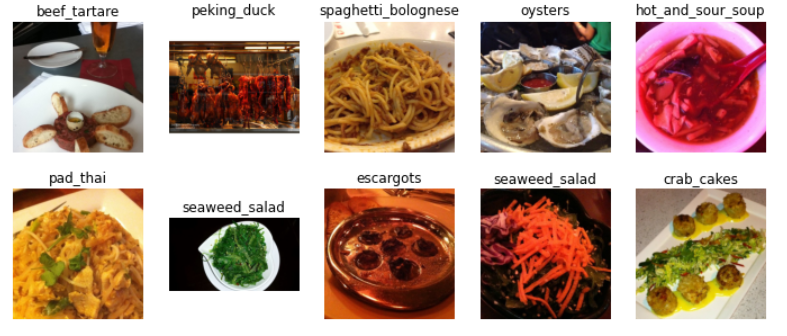
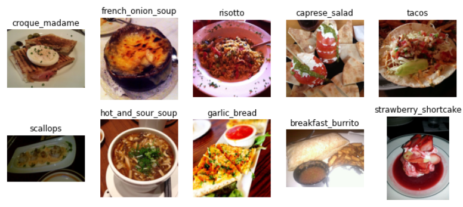
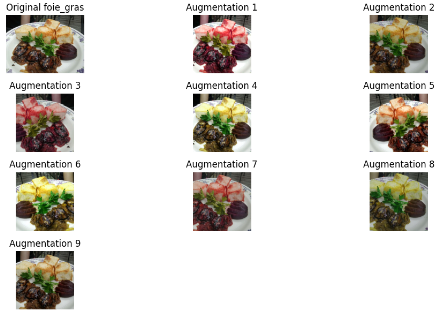
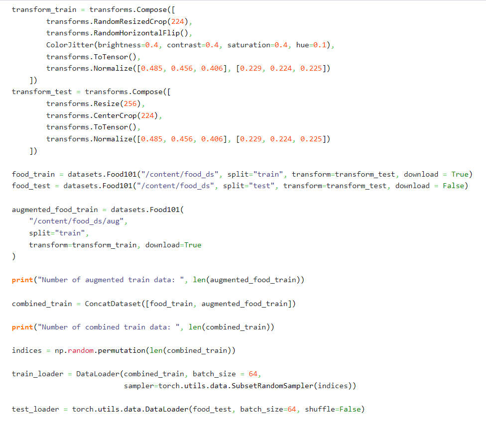
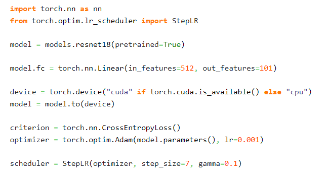
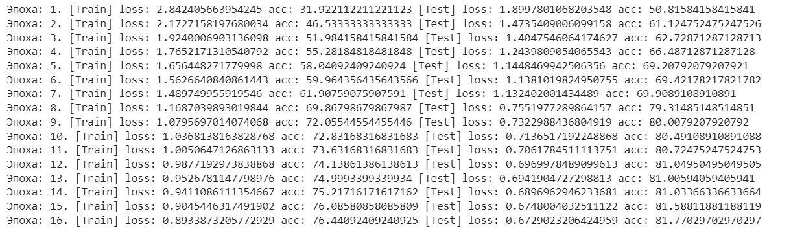
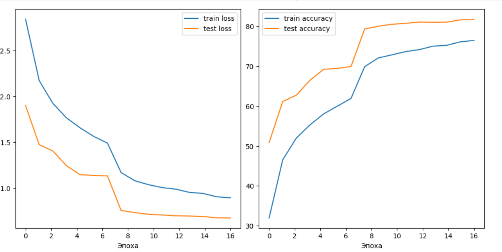
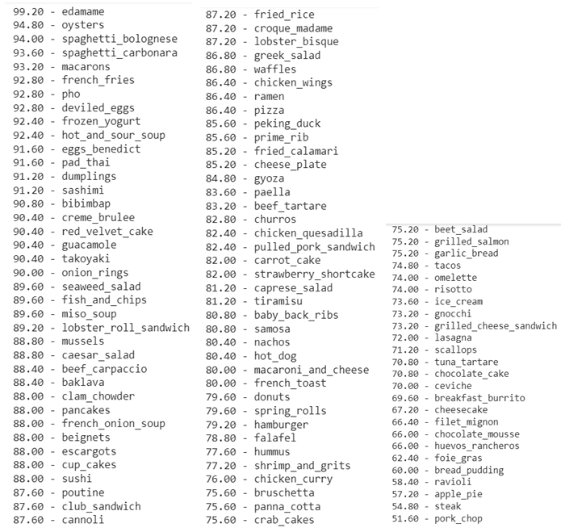
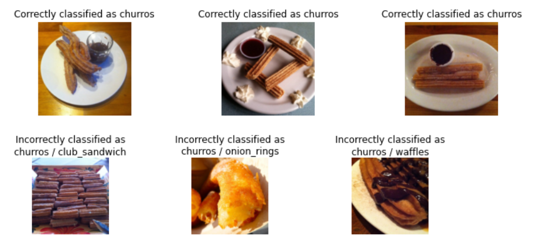
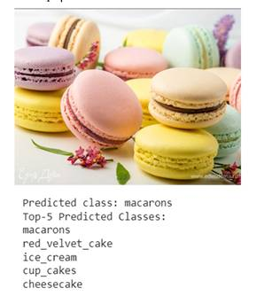

# Pytorch-food-classification

# **Оглавление**
[**ВВЕДЕНИЕ**](#_toc139242079)

[**1. Набор данных FOOD-101**](#_toc139242089)

[**2. Создание загрузчика данных для обучения нейронной сети**](#_toc139242090)

[**3. Аугментация данных для повышения эффективности обучения нейронной сети**](#_toc139242091)

[**4. Перенос обучения**](#_toc139242093)

[**5. Обучение нейронной сети**](#_toc139242094)

[**6. Оценка результатов классификации**](#_toc139242095)

[**ЗАКЛЮЧЕНИЕ**](#_toc139242096)

**ВВЕДЕНИЕ**

Классификация блюд с помощью нейронных сетей является актуальной и важной темой с практическим применением в пищевой промышленности. Она может повысить эффективность служб доставки еды и помочь в лечении заболеваний и соблюдении диеты. Анализ изображений разных видов блюд позволяет классифицировать их по разным категориям и прогнозировать калорийность, что может быть полезно при лечении заболеваний и соблюдении диеты. Кроме того, классификация состояний объектов для приготовления пищи может быть полезна для распознавания активности того, что готовится, что улучшает понимание и предсказание.

Например, в одном исследовании была использована настроенная сверточная нейронная сеть VGG для классификации семи различных состояний пищевого продукта, включая такие как «целое», «выжатый сок», «нарезанный ломтиками», «нарезанный кубиками», «сливочная паста» и «тертый» [1]. Также, в другом исследовании, была использована сверточная нейронная сеть для классификации блюд тайского фаст-фуда на основе их изображений и прогноза калорийности блюд [2].

Классификация блюд может помочь в доставке, так как позволяет автоматически распознавать блюда на фотографиях и определять их название и состав, что может быть полезно для составления меню и управления запасами продуктов. Например, исследование показало, что использование классификации изображений блюд может помочь в автоматизации процесса составления меню для ресторанов и кафе [3]. В нем использовался набор данных, содержащий изображения блюд, разделенных на категории, такие как супы, салаты, мясные блюда и т.д. С помощью классификации изображений была разработана система, которая автоматически составляет меню на основе предпочтений клиентов и наличия продуктов на складе.

Таким образом, классификация блюд с помощью нейронных сетей имеет несколько потенциальных применений, которые могут повысить эффективность служб доставки еды, помочь в управлении медицинскими состояниями и соблюдением диеты, а также помочь в обнаружении фальсификации и порчи продуктов. Кроме того, классификация состояний продуктов для приготовления пищи может быть полезна для распознавания состояния готовности блюда.

Целью данного исследования является разработка точных и эффективных моделей для классификации различных типов блюд на основе их изображений. Основная задача состоит в том, чтобы достичь высокой точности в классификации блюд при минимизации вычислительной мощности, необходимой для обучения.

**Набор данных FOOD-101**

В задаче классификации изображений блюд, выбор подходящего набора обучающих данных играет ключевую роль. Несмотря на то, что в последние годы было создано множество подобных наборов, не все они подходят для решения данной задачи. В данном параграфе мы рассмотрим набор данных FOOD-101, который является одним из наиболее подходящих для классификации изображений блюд.

Набор данных FOOD-101 был создан в 2014 году и содержит более 100 тысяч изображений 101 различной категории блюд. Каждая категория содержит примерно 1000 изображений, сделанных в различных условиях освещения, углах и масштабах.

Разнообразие кухонь, представленных в FOOD-101, а также высокое качество изображений и широкий спектр блюд, включая десерты, напитки и закуски, делают его применимым во многих сферах и позволяют удовлетворить большинство потребностей различных приложений, таких как поисковики ресторанов или фитнес-приложения. Кроме того, в наборе данных содержится много изображений для каждой категории, что повышает точность алгоритмов классификации, обученных на этих изображениях.

Значимым аспектом FOOD-101 является то, что изображения были собраны из интернета, а не были профессионально сфотографированы. Это означает, что изображения содержат различные артефакты, такие как шум, размытость, изменение цвета и т.д., что соответствует несовершенному качеству анализируемых фотографий в реальных условиях и проектах.

Для работы с набором данных FOOD-101 необходимо сначала загрузить его и разделить на обучающую и тестовую выборки. Обычно для обучения модели используется 70-80% изображений, а оставшиеся 20-30% используются для тестирования.

В данной работе для загрузки данных используется модуль Datasets из библиотеки Torchvision.

На рисунке 1 представлены примеры изображений, которые входят в обучающий набор данных, а на рисунке 2 – примеры изображений из тестового набора данных.

Рисунок 1. Пример изображений из тренировочного набора данных

Рисунок 2. Пример изображений из тестового набора данных

**Создание загрузчика данных для обучения нейронной сети**

Dataloader (загрузчик данных) – это компонент, который используется для эффективной загрузки и предварительной обработки данных во время обучения нейронных сетей. Он выполняет несколько важных функций:

1\. Загрузка данных: Dataloader позволяет загружать данные из различных источников, таких как файлы на диске, базы данных или веб-сервисы. Он упрощает процесс чтения и представления данных в формате, который можно использовать для обучения модели.

2\. Пакетная обработка: Вместо загрузки и обработки данных по одному примеру за раз, Dataloader позволяет группировать данные в пакеты (batch) определенного размера. Это позволяет эффективно использовать вычислительные ресурсы и ускоряет обучение модели, так как многие операции, такие как вычисление градиентов, могут быть выполнены параллельно на пакетах данных.

3\. Перемешивание данных: Часто желательно перемешивать данные перед каждой эпохой обучения, чтобы модель не запоминала порядок примеров. Dataloader позволяет автоматически перемешивать данные перед каждой эпохой, что способствует лучшей обобщающей способности модели.

4\. Предварительная обработка данных: Dataloader может выполнять предварительную обработку данных перед их использованием для обучения модели. Например, он может применять нормализацию, изменение размера изображений или преобразование данных в числовой формат, понятный для модели.

5\. Распределение данных на устройства: Dataloader позволяет эффективно распределить данные на доступные вычислительные устройства, такие как графические процессоры (GPU). Это особенно полезно при обучении глубоких нейронных сетей, которые требуют больших вычислительных мощностей.

Загрузчик данных настраивается в соответствии с типом и форматом данных, используемых в нейронной сети, а также с учетом требований к обработке данных. Он может быть написан как на языке Python, так и на других языках программирования.

В целом, Dataloader облегчает загрузку, предварительную обработку и эффективную работу с данными во время обучения нейронных сетей, что упрощает процесс разработки и улучшает производительность моделей.

**Аугментация данных для повышения эффективности обучения нейронной сети.**

Для достижения высокой производительности моделей требуется большой объем размеченных данных. В реальных сценариях часто бывает сложно собрать достаточное количество данных для обучения модели. В таких случаях аугментация данных становится полезным инструментом, который позволяет увеличить эффективность обучения моделей глубокого обучения.

Аугментация данных – это процесс искусственного увеличения разнообразия обучающего набора данных путем применения различных трансформаций к существующим изображениям. Это может включать изменение размера, повороты, сдвиги, отражения, изменение яркости и контраста и другие операции, которые сохраняют семантику изображения, но вносят некоторое разнообразие.

Преимущества аугментации данных:

1\. Увеличение разнообразия данных. Аугментация данных позволяет создать больше различных вариаций изображений, что помогает модели обучаться на более широком спектре данных;

2\. Регуляризация модели. Аугментация данных может помочь уменьшить переобучение путем введения случайных изменений в обучающие данные, что помогает модели обобщать лучше на новых данных;

3\. Устойчивость к шуму. Аугментация данных может улучшить устойчивость модели к шуму и искажениям, поскольку модель будет обучаться на изображениях с различными искажениями.

PyTorch предоставляет мощные инструменты для реализации аугментации данных. Один из таких инструментов – класс torchvision.transforms из библиотеки PyTorch. Он предоставляет различные функции преобразования изображений, которые могут быть использованы для аугментации данных. Например, функция RandomResizedCrop случайным образом обрезает и изменяет размер изображения до заданного размера, а функция ColorJitter изменяет яркость, контраст, насыщенность и оттенок изображения. Эти функции могут быть комбинированы и применены в цепочке, чтобы создать разнообразные преобразования и увеличить разнообразие данных для обучения моделей глубокого обучения.

На рисунке 3 представлено оригинальное изображение и его вариации с примененными случайным образом функциями  преобразования размера, изменения яркости, контраста, насыщенности и оттенка.

Рисунок 3. Пример аугментации данных набора FOOD-101

Таким образом, расширим исходный набор обучающих данных дополнительными изображениями. Соответствующий код представлен на рисунке 4.

Рисунок 4. Аугментация данных 

**Перенос обучения**

Перенос обучения – это технология машинного обучения, которая позволяет использовать предобученные модели для решения новых задач.

Вместо того чтобы обучать новую модель с нуля, используется уже ранее обученная модель, которая может решать сходные задачи. Изменяется только выходной слой модели, чтобы адаптировать ее к новой задаче. Переобучение на новых данных может занять значительно меньше времени, чем обучение модели с нуля, поскольку большая часть модели уже обучена и готова к использованию.

Перенос обучения используется в тех областях, где есть необходимость классифицировать большое количество данных. Например, в задачах классификации изображений, где мы можем использовать предобученную модель для классификации новых изображений. Подобно этому, можно использовать уже обученные модели для классификации данных о продуктах или для анализа текстовых данных.

Основное преимущество переноса обучения заключается в экономии времени и ресурсов, необходимых для обучения новой модели. Кроме того, перенос обучения может значительно повысить точность классификации, поскольку уже обученная модель содержит знания, которые можно использовать для решения новых задач. В целом, перенос обучения – это технология, которая может существенно сократить время и ресурсы, необходимые для обучения новых моделей на больших объемах данных. 

В ходе исследования было проведено сравнение различных предобученных моделей, таких как DenseNet121, ResNet50 и InceptionV3, которые предварительно обучены на обширном наборе данных ImageNet и достигли впечатляющих результатов в классификации изображений. 

Однако, при использовании этих моделей в данной работе, было обнаружено, что время, затрачиваемое на одну эпоху обучения, значительно увеличивается. Это может быть связано с более сложной архитектурой данных моделей и большим количеством обучаемых параметров, что требует большего времени для вычислений.

В связи с этим, для оптимизации данной исследовательской работы было принято решение выбрать сеть ResNet18. Эта модель представляет собой более легкую версию оригинальной архитектуры ResNet, имеющую меньшее количество слоев и параметров. Такой выбор обусловлен необходимостью снижения времени обучения модели, при этом сохраняя достаточную точность классификации изображений.

Таким образом, выбор сети ResNet18 является оптимальным для данной исследовательской работы, позволяя достичь приемлемого баланса между временем обучения и точностью классификации изображений блюд.

Сеть ResNet18 была разработана в 2015 году и представляет собой упрощенную версию оригинальной сети ResNet, ее основным преимуществом является использование блоков с пропусками, известных как "связи-с-пропусками" или "shortcut connections". Эти блоки позволяют обучаемым слоям получать информацию не только от предыдущих слоев, но и напрямую от более ранних слоев. Такой подход помогает сети избежать проблемы затухания градиента и позволяет успешно обучать глубокие модели.

Архитектура ResNet18 состоит из 18 слоев, включая сверточные слои, пулинг, полносвязные слои и слои активации. Она имеет два основных типа блоков: базовый блок и блок с увеличением размерности. Базовый блок состоит из двух сверточных слоев с фильтрами размером 3x3 и функцией активации ReLU. Блок с увеличением размерности используется для изменения размерности тензора и увеличения глубины признаков.

Для использования предобученной сети ResNet18 в нашей задаче классификации с 101 классом, мы должны изменить последний полносвязный слой на новый слой с 101 выходом. Это связано с тем, что предобученная сеть была обучена на другом наборе данных, вероятно с другим количеством классов.

Кроме того, нам потребуется выбрать оптимизатор и критерий для обучения модели. В данном случае, мы можем использовать оптимизатор Adam, который является популярным выбором для обучения нейронных сетей. Оптимизатор Adam сочетает в себе методы адаптивного градиентного спуска и коррекции импульса для эффективной оптимизации модели.

Для критерия (или функции потерь) мы можем использовать CrossEntropyLoss. CrossEntropyLoss является одним из наиболее распространенных критериев для задач классификации с множеством классов. Он автоматически применяет функцию Softmax к выходам модели и вычисляет кросс-энтропийную потерю между предсказанными вероятностями классов и истинными метками классов.

Таким образом, для использования предобученной сети ResNet18 в нашей задаче, мы должны изменить последний полносвязный слой на слой с 101 выходом, выбрать оптимизатор Adam и критерий CrossEntropyLoss для обучения модели.

Описанный алгоритм представлен на рисунке 5.

Рисунок 5. Построение модели

В итоге, выбор сети ResNet18 для данной исследовательской работы обусловлен ее высокой эффективностью, способностью успешно обучаться на наборе данных ImageNet и возможностью достичь приемлемых результатов в классификации изображений блюд при более низком времени обучения.

**Обучение нейронной сети**

В процессе обучения нейронной сети используются различные параметры, которые влияют на процесс обучения.

Одним из таких параметров является эпоха, которая представляет собой прохождение всего тренировочного набора данных через нейронную сеть. То есть эпоха заканчивается, когда каждый тренировочный экземпляр был просмотрен обучаемой моделью. 

Еще одним параметром является пакет (или батч), который представляет собой небольшой набор примеров тренировочных данных, на основе которых вносятся коррективы в обучаемую модель. 

Итерация определяет количество таких пакетов, которые должны пройти через модель, чтобы завершить одну эпоху. Кроме того, обучение модели нейронной сети можно остановить, когда достигнута требуемая точность или когда ошибка нейронной сети перестала уменьшаться. 

Важно учитывать все эти параметры при обучении нейронной сети, чтобы достичь наилучших результатов.

Исследуемая в данной работе модель классификации изображений блюд была обучена с использованием Google Colab Notebook – сервиса, который представляет собой интерактивную среду на языке Python. Google Colab предоставляет бесплатный доступ к графическим процессорам и позволяет выполнять код, создавать и обучать модели машинного обучения.

Спроектированная модель была обучена на 16 эпохах, перестала улучшаться. Это означает, что дальнейшее обучение модели не приводит к существенному повышению ее способности делать правильные предсказания или улучшению ее общей производительности. 

Точность модели – это метрика, которая измеряет, насколько точно модель делает предсказания. В процессе обучения модель стремится минимизировать ошибки и максимизировать точность, чтобы достичь наилучших результатов. Однако, после некоторого количества эпох обучения, модель может достичь своего предельного предсказательного потенциала и перестать значительно улучшаться.

Такое явление называется сходимостью модели. Сходимость означает, что модель достигла оптимальных значений своих параметров и дальнейшее обучение не приводит к заметному повышению точности. Это может быть связано с насыщением данных, ограничениями архитектуры модели или недостаточным объемом данных для обучения.

Поэтому, в данном случае, модель была остановлена после 16 эпох, так как дальнейшее обучение не приводило к значимому улучшению точности модели.

Результаты обучения построенной модели представлены на рисунке 6. Изменения значений точности и потерь модели на каждой эпохе графически представлены на рисунке 7.

Рисунок 6. Результаты обучения

Рисунок 7. Графики обучения

**Оценка результатов классификации**

Для оценки качества классификации были применены различные метрики оценки, которые позволяют оценить эффективность работы моделей.

В результате проведенной классификации были получены следующие оценки по метрикам:

- Accuracy: 0.8177

Данная метрика измеряет общую точность классификации и показывает, насколько хорошо модель правильно классифицировала изображения. В данном случае, полученное значение accuracy составляет 81.77%, что говорит о достаточно высокой точности классификации.

- Macro Precision: 0.8175

Данная метрика измеряет среднюю точность классификации по всем классам. Полученное значение macro precision также составляет 81.75%, что указывает на хорошую точность классификации для каждого класса в отдельности.

- Macro Recall: 0.8177

Метрика macro recall измеряет среднюю полноту классификации по всем классам. Значение macro recall составляет 81.77%, что свидетельствует о том, что модель способна правильно обнаруживать объекты каждого класса.

- Macro F1-Score: 0.8169

Данная метрика представляет собой среднее гармоническое между точностью и полнотой классификации. Полученное значение macro F1-score составляет 81.69%, что указывает на хороший баланс между точностью и полнотой классификации для всех классов.

Micro Precision, Micro Recall, Micro F1-Score: все три метрики имеют одинаковые значения, равные 0.8177. Эти метрики учитывают общее количество верно классифицированных и неверно классифицированных изображений для всех классов.

Кроме указанных метрик также полезно рассмотреть точность классификации по отдельным классам. Это позволяет оценить процент правильно классифицированных изображений для каждого класса относительно общего количества изображений этого класса.

Распределение точности по классам предоставляет информацию о способности модели правильно классифицировать каждый класс отдельно. Она позволяет выявить классы, для которых модель может иметь проблемы с классификацией, и позволяет сравнивать точность между разными классами. Подобное распределение для полученной в ходе работы модели представлено на рисунке 4.4.

Рисунок 8. Точность по классам

Для более наглядной иллюстрации результатов классификации представлены примеры верно и неверно классифицированных изображений на рисунке 4.5.

Рисунок 9. Примеры верно и неверно классифицированных изображений

Дополнительно, на рисунке 4.6 представлен пример классификации изображения из интернета, включая топ-1 и топ-5 классификации, что демонстрирует способность модели к классификации изображений в реальном мире.

Рисунок 10. Классификация макаронс

В целом, полученные результаты классификации свидетельствуют о высокой точности и эффективности модели, а также о ее способности правильно распознавать и классифицировать объекты различных классов.
